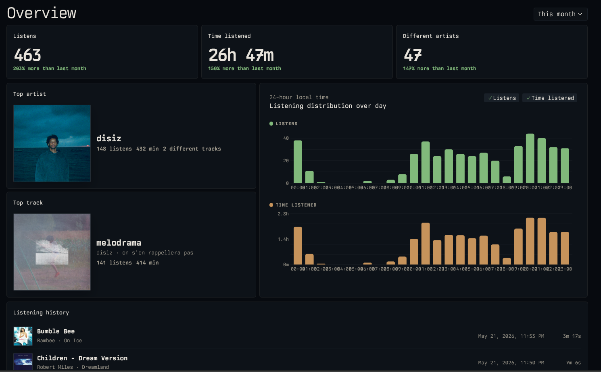
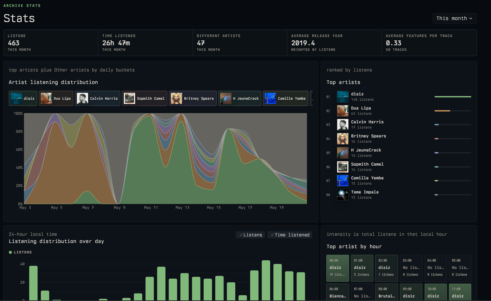
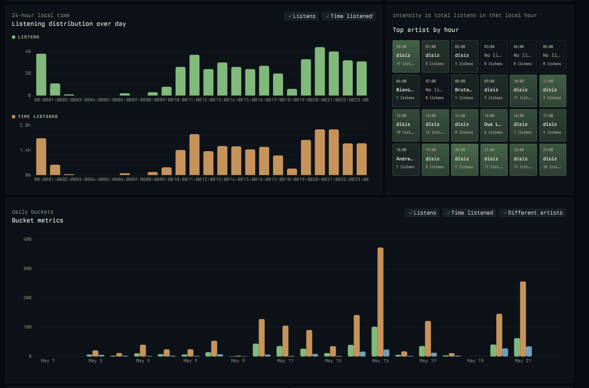

<!-- markdownlint-disable MD033 MD041 -->

  <h1 id="header">Spotrak</h1>
   
  <h6>A no-bullshit, self-hostable music tracking dashboard for Spotify.</h1>
   

## Features

- **Live music tracking**: See what you're listening to in real-time.
- **Import your listening history**: Import your full Spotify listening history.

# Images, because that's the only thing that counts! :D

  

  

  

